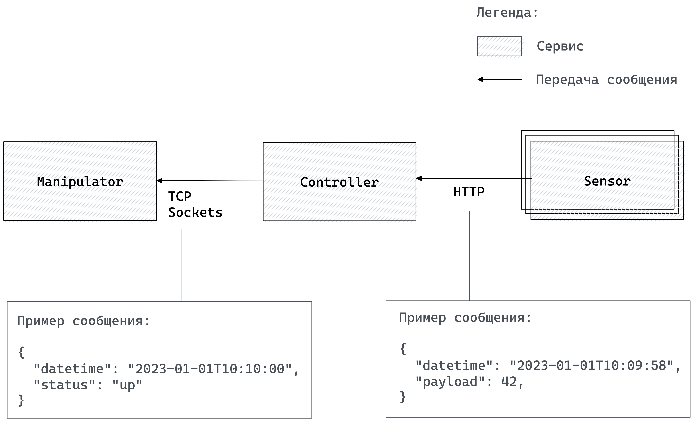

# test_invian

Тестовое задание на вакансию Python-разработчик в Инвиан.

## Содержание

<ol>
<li>
    <a href="#содержание">Содержание</a>
</li>
<li>
    <a href="#руководство-по-запуску">Руководство по запуску</a>
</li>
<li>
    <a href="#задачи">Задачи</a>
</li>
<li>
    <a href="#описание-компонентов-системы">Описание компонентов системы</a>
    <ul>
        <li><a href="#sensor">Sensor</a></li>
        <li><a href="#controller">Controller</a></li>
        <li><a href="#manipulator">Manipulator</a></li>
    </ul>
</li>
<li>
    <a href="#использованные-инструменты">Использованные инструменты</a>
</li>
</ol>

## Руководство по запуску

Загрузите исходный код проекта на свое устройство с помощью следующей команды:

```shell
git clone https://github.com/EveryoneHATEme/test_invian
```

Соберите проект, введя в корневой директории репозитория следующую команду в консоль:
```shell
docker compose build
```

Запустите образ docker с помощью следующей команды:

```shell
docker compose up
```

## Задачи
1. Реализовать компоненты архитектуры, изображенной на диаграмме используя Python 3, допускается использование любых библиотек/фреймворков/инструментов.
2. Обеспечить взаимодействие компонент друг с другом.
3. Создать docker-compose конфигурацию для запуска.
4. Создать документацию по запуску системы.
5. Создать репозиторий в GitHub с результатами прошлых пунктов

<p>
    
</p>
<p>
    <em>Архитектура компонент и их взаимодействие</em>
</p>

## Описание компонентов системы

### Sensor

Компонент, генерирующий данные, на основе которых контроллер принимает решение. Всего 8 сенсоров, каждый генерирует 300 сообщений в секунду, сообщения равномерно распределены по секунде и отправляются раздельно (один запрос на одно сообщение). Алгоритм генерации данных на усмотрение.

### Controller

Компонент, который по TCP соединению управляет манипулятором, на базе данных от сенсоров. Алгоритм принятия решения о статусе на усмотрение, но должен использовать данные с сенсоров.

API контроллера должен соответствовать REST API.

Обработка данных с сенсоров происходит параллельно/асинхронно, однако важно обрабатывать сообщения в интервалы 5 секунд. Т. е. каждые 5 секунд принимается решение об управляющем сигнале для манипулятора.

Устаревшая информация не должна приниматься во внимание при принятии решения. Сообщение считается устаревшим, если информация из этого сообщения имеет время создания раньше принятия последнего решения об управляющем сигнале.

Контроллер должен уметь через API отдавать список отправленных управляющих сигналов за указанный интервал времени.

### Manipulator

Компонент, который принимает сигналы по TCP соединению и выводит их в консоль/логи для демонстрации.

## Использованные инструменты
* [Python](https://www.python.org/) 3.10
  * [FastAPI](https://fastapi.tiangolo.com/) - Современный, быстрый веб-фреймворк для реализации API.
  * [aio-pika](https://aio-pika.readthedocs.io/en/latest/) - Асинхронная версия фреймворка [pika](https://pika.readthedocs.io/en/stable/), служащий оболочкой для взаимодействия с [RabbitMQ](https://www.rabbitmq.com/)
* [RabbitMQ](https://rabbitmq.com/) 3.13 - Брокер сообщений, используется как очередь для сообщений до обработки и вычисления сигнала на манипулятор
* [Docker](https://docker.com/) 25.0.4 - Контейнизатор приложений, позволяет автоматически разворачивать и управлять приложениями